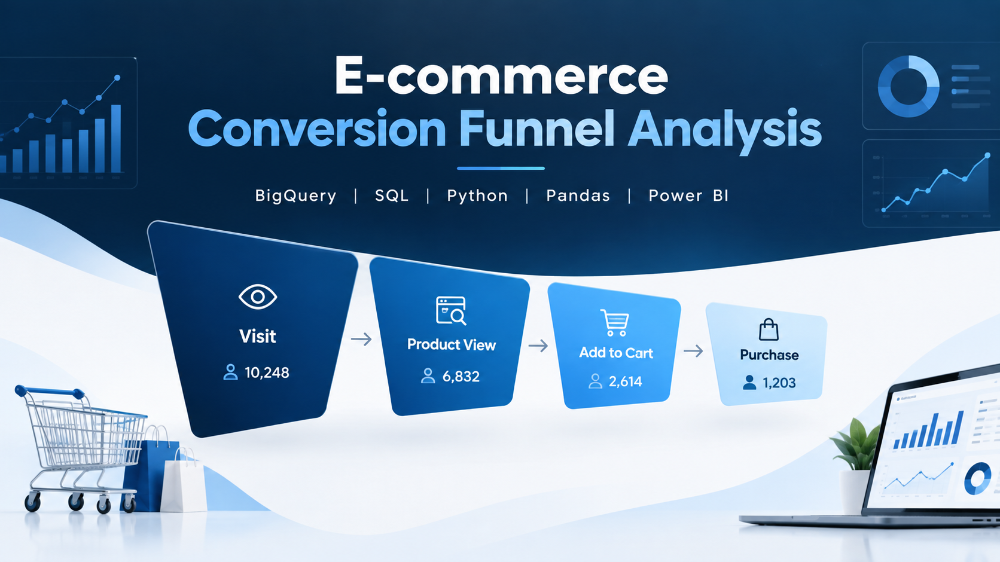

<p align="center">
  
</p>

# 🛒 E-commerce Conversion Funnel Analysis

An end-to-end **E-commerce Conversion Funnel Analysis** project built to understand user behavior across the purchase journey, identify major drop-off points, measure conversion performance, and derive actionable business insights.

The project follows a complete analytics workflow:

**BigQuery SQL → Python/Pandas EDA → Power BI Dashboard → Business Insights & Recommendations**

---

## 📌 Project Overview

E-commerce businesses receive a large number of visitors, but only a portion of them progress through the complete purchase journey.

This project analyzes the conversion funnel:

**Visit → Product View → Add to Cart → Purchase**

The analysis focuses on:

- Identifying where users drop off
- Measuring stage-to-stage conversion rates
- Identifying major funnel bottlenecks
- Analyzing monthly conversion trends
- Validating results using Python/Pandas
- Building a concise Power BI dashboard
- Generating actionable business recommendations

---

## 🎯 Business Objectives

The main objectives of this project are to:

- Analyze the complete e-commerce conversion funnel
- Measure user drop-off at each funnel stage
- Calculate stage-to-stage conversion rates
- Identify major bottlenecks in the customer journey
- Analyze monthly funnel performance
- Validate SQL-based results using Python
- Build a concise Power BI dashboard
- Generate actionable business recommendations

---

## 🔄 Conversion Funnel

The analysis focuses on four key stages:

**Visit → Product View → Add to Cart → Purchase**

| Funnel Stage | Description |
|---|---|
| **Visit** | Users who visited the website |
| **Product View** | Users who viewed a product |
| **Add to Cart** | Users who added a product to their cart |
| **Purchase** | Users who completed a purchase |

---

## 🛠️ Tools & Technologies

| Tool | Purpose |
|---|---|
| **Google BigQuery** | Data preparation, aggregation and SQL analysis |
| **SQL** | Funnel calculations, bottleneck analysis and monthly analysis |
| **Python** | Exploratory Data Analysis and validation |
| **Pandas** | Data manipulation and analysis |
| **Matplotlib** | Analytical visualizations |
| **Power BI** | Dashboard and data visualization |
| **GitHub** | Project documentation and version control |

---

## 📊 SQL Analysis

BigQuery was used to transform event-level e-commerce data into analysis-ready summary tables.

### Key SQL Analyses

- Funnel stage aggregation
- Stage-to-stage conversion rates
- User drop-off analysis
- Bottleneck identification
- Monthly funnel analysis
- Channel-level funnel analysis
- Device-level funnel analysis
- KPI summary

### Analysis Tables

- `funnel_data`
- `funnel_metrics`
- `bottleneck_analysis`
- `monthly_funnel`
- `monthly_funnel_analysis`
- `channel_funnel`
- `device_funnel`
- `funnel_kpi_summary`

---

## 🐍 Python / Pandas EDA

Python and Pandas were used for exploratory analysis and validation of the funnel data.

The analysis included:

- Dataset exploration
- Data structure and quality checks
- Funnel stage performance
- Conversion rate analysis
- Drop-off analysis
- Monthly conversion trends
- Month-on-Month conversion changes
- Highest conversion month identification
- Lowest conversion month identification
- Monthly trend visualization
- Visitors vs Purchases trend analysis
- Validation of SQL results

The Python analysis provided additional analytical context before creating the Power BI dashboard.

---

## 📈 Power BI Dashboard

The final Power BI dashboard is designed as a **single-page business dashboard** with three main visuals.

### 1. Conversion Funnel

Shows the progression through the complete customer journey:

**Visit → Product View → Add to Cart → Purchase**

This visual provides a quick view of the number of users remaining at each stage.

### 2. Funnel Stage Conversion / Drop-off

Highlights the conversion and drop-off between consecutive funnel stages.

The analysis covers:

- Visit → Product View
- Product View → Add to Cart
- Add to Cart → Purchase

### 3. Monthly Visitors vs Purchases

Shows how visitor volume and purchase volume change over time, helping identify differences between traffic volume and completed purchases.

The dashboard was intentionally kept concise to provide a clear view of funnel performance without unnecessary visual clutter.

---

## 💡 Business Insights

### 1. High Drop-off at Product Discovery

Only **22.70%** of visitors progress from Visit to Product View, resulting in a **77.30% drop-off** at the first major funnel transition.

This indicates that a large proportion of visitors do not progress to product-level engagement.

### 2. Product-to-Cart Conversion Challenge

The Product View → Add to Cart stage has a **20.48% conversion rate** and a **79.52% drop-off rate**.

This represents the largest stage-level drop-off in the analyzed funnel and highlights the importance of improving product-page engagement and purchase intent.

### 3. Add-to-Cart to Purchase Performance

The Add to Cart → Purchase stage has a **35.23% conversion rate**, with a **64.77% drop-off**.

Although this stage converts a higher proportion of users than the earlier funnel transitions, a significant number of users still leave before completing the purchase.

### 4. Overall Funnel Observation

The analysis shows that the major user losses occur during the **early stages of the customer journey**, particularly before users add products to their carts.

This suggests that improving product discovery, product-page engagement, and add-to-cart behavior can be important areas for further investigation.

---

## 📌 Key Funnel Metrics

| Funnel Transition | Conversion Rate | Drop-off Rate |
|---|---:|---:|
| Visit → Product View | **22.70%** | **77.30%** |
| Product View → Add to Cart | **20.48%** | **79.52%** |
| Add to Cart → Purchase | **35.23%** | **64.77%** |

---

## 🚀 Business Recommendations

Based on the funnel analysis, the following areas can be investigated to improve conversion performance:

### 1. Improve Product Discovery

- Improve navigation and product categorization
- Optimize search functionality
- Improve landing-page relevance
- Analyze traffic sources bringing low-engagement visitors

### 2. Improve Product Page Engagement

- Make product information easier to understand
- Improve product images and descriptions
- Highlight pricing, offers and product benefits clearly
- Make the Add to Cart action more visible

### 3. Reduce Cart-to-Purchase Drop-off

- Simplify the checkout process
- Reduce unnecessary checkout steps
- Provide clear pricing and delivery information
- Investigate cart abandonment behavior
- Improve payment and checkout usability

### 4. Monitor Monthly Funnel Performance

Monthly conversion trends should be monitored to identify:

- Changes in customer behavior
- Unusual conversion fluctuations
- Traffic-quality changes
- Periods requiring deeper investigation

---

## 🔬 Analytical Workflow

The project follows a structured end-to-end analytics workflow:

```text
Raw E-commerce Event Data
          ↓
     Google BigQuery
          ↓
       SQL Analysis
          ↓
   Funnel Summary Tables
          ↓
      Python / Pandas
          ↓
    Exploratory Analysis
          ↓
      Power BI
          ↓
   Business Dashboard
          ↓
 Business Insights
          ↓
 Recommendations
